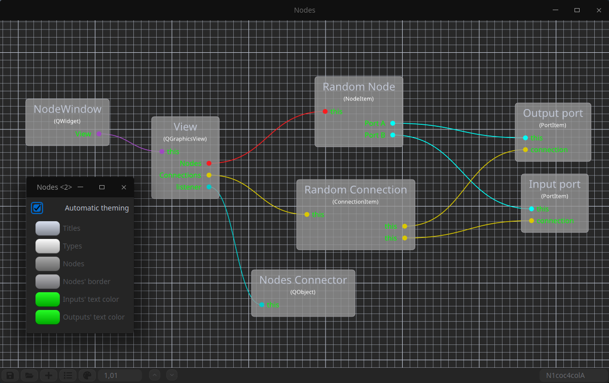
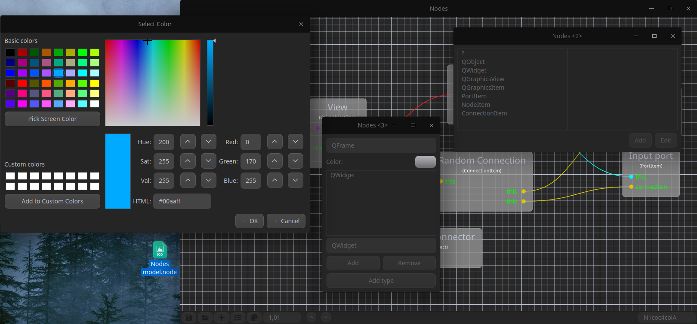

# Nodes

## What is it?
This project is a node editor to show logic and links between things. It can be used for workflows: how your apps should work, or to make what frenchies call "Carte Mentale".




## From where does it comes from?
The basis of making this was to use it to describe in-app APIs for beginners that might work with me on different projects.
I was looking for already done apps that was with a "node" system, or diagram. I finally found: https://github.com/bhowiebkr/logic-node-editor
I translated the code to C++, and added features.

## Features
| Feature        | State       |
|----------------|-------------|
| Nodes          | Implemented |
| Connections    | Implemented |
| Ports of types | Implemented |
| Connections colors | Implemented |
| Saving nodes | Implemented |
| Save connections | Implemented |
| Saving extra data | Implemented |
| Node theming | Implemented |
| Saving types | Implemented |
| Node theme editor | Implemented |

## Shortcuts
| Name | Control |
|----------------|-------------|
| New node | Shift+N |
| Edit a node | Shift+E |
| Remove an element | Del |
| Save document | Ctrl+S |
| Open document | Ctrl+O |

## Which dependencies?
```
Qt Core
Qt Widget
Qt OpenGL
```

## How to compile the app?
A simple
```
$ qmake
$ make
```
In the source directory is enough.

## How to use it?
There's a little bar at the bottom of the window. I let you use the small number of features it has. A hidden option is to set the ports (points in nodes) on the left or right, you can check or uncheck it. To connect two ports, just do like DnD. Ctrl+Scroll is used to zoom in/out as the bottom spinner can be used too.

## Is it licensed?
Yes for sure! But to let you do more things and improve it if you want to, it is under GNU Public License v3.
